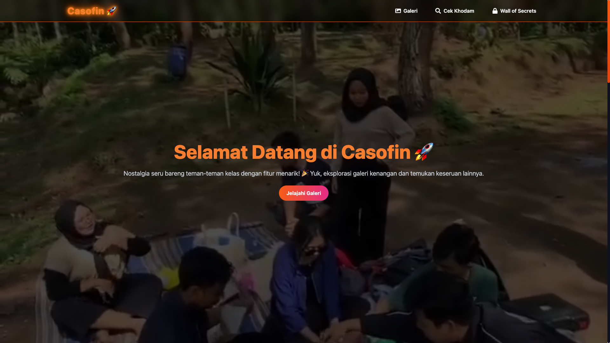

# 🎓 Casofin – Portofolio & Kenangan Kelas  

  

Yo, welcome to **Casofin**! Ini bukan sekadar website, tapi tempat buat ngejaga dan nge-share semua momen epic selama kuliah. Mau nostalgia? Mau liat siapa aja temen sekelas yang masih aktif? Atau sekadar cek siapa yang suka ngilang pas jam kuliah? **Casofin** tempatnya!  

📌 **Live Demo**: [Casofin di Vercel](https://casofin.vercel.app)  

---

## ✨ Fitur-Fitur Keren  

✅ **Galeri Kelas** – Simpan dan share foto serta video kenangan kelas biar nggak ilang begitu aja.  
✅ **Cek Kodam** – Lihat kodham mu sekarang juga.  
✅ **Wall of Secret** – Curhat atau share pesan anonim tanpa takut ketahuan siapa yang nulis.  
✅ **Anggota Kelas** – Lihat daftar lengkap geng kelas, lengkap dengan profil mereka.  dikenang bareng-bareng. .   
✅ **Responsive & Mudah Digunakan** – Bisa diakses dari HP, laptop, tablet, pokoknya fleksibel abis!  

---

## 🛠️ Teknologi yang Dipakai  

| Teknologi | Deskripsi |
|-----------|-----------|
| **React.js** | Framework utama buat frontend |
| **Vite** | Build tool buat development super cepat |
| **Firebase** | Backend buat autentikasi & database |
| **Tailwind CSS** | Buat styling biar webnya keliatan fresh |
| **Cloud Storage** | Buat nyimpen foto & video kelas |
| **Vercel** | Buat deploy website secara instan |

---

## 📥 Cara Install & Jalankan di Lokal  

### 1️⃣ **Clone Repositori**  
```bash
git clone https://github.com/LearnWithSuryaa/casofin
cd casofin
```

### 2️⃣ **Install Dependensi**  
```bash
npm install
```

### 3️⃣ **Setup Environment Variables**  
Buat file `.env.local` di root proyek dan tambahkan ini:  
```env
VITE_FIREBASE_API_KEY=your-api-key
VITE_FIREBASE_AUTH_DOMAIN=your-auth-domain
VITE_FIREBASE_PROJECT_ID=your-project-id
VITE_FIREBASE_STORAGE_BUCKET=your-storage-bucket
VITE_FIREBASE_MESSAGING_SENDER_ID=your-messaging-sender-id
VITE_FIREBASE_APP_ID=your-app-id
VITE_FIREBASE_MEASUREMENT_ID=your-measurement-id
```
Ganti `your-...` dengan data Firebase kalian.  

### 4️⃣ **Jalankan Webnya**  
```bash
npm run dev
```
Akses di `http://localhost:5173` langsung gas!  

---

## 🚀 Deploy ke Vercel  

Mau deploy sendiri? Gampang!  

1. **Fork repo ini** ke akun GitHub kalian.  
2. **Hubungkan ke Vercel** lewat akun GitHub.  
3. **Tambahkan Environment Variables** di dashboard Vercel.  
4. **Klik Deploy**, dan website langsung online!  

---

## 👨‍💻 Kontribusi? Gaskeun!  

Pengen ikut ngembangin Casofin? Bisa banget! Apalagi buat kalian yang mau belajar React & Firebase! 🚀  

### 💡 Cara Ikut Kontribusi  
1. **Fork repo ini** ke akun kalian.  
2. **Buat branch baru** buat fitur atau fix bug:  
   ```bash
   git checkout -b fitur-baru
   ```
3. **Edit & kembangkan fitur** sesuai keinginan.  
4. **Commit perubahan** dengan pesan yang jelas:  
   ```bash
   git commit -m "Nambah fitur X"
   ```
5. **Push branch ke GitHub**:  
   ```bash
   git push origin fitur-baru
   ```
6. **Buat Pull Request (PR)** di GitHub & tunggu review.  

🔹 **Note:** Pastikan kode kalian clean & sesuai standar sebelum PR ya!  

---

## 📝 Lisensi  
Proyek ini berlisensi di bawah GNU General Public License v3.0. Artinya, kalian bebas buat pakai, modifikasi, dan distribusi ulang proyek ini selama tetap mematuhi ketentuan GNU GPL v3.0.

📜 Baca lisensi lengkapnya di sini: GNU GPL v3.0 

📩 Ada pertanyaan atau mau ngobrol? Email aja ke `davindra514@gmail.com`  

🚀 **Jangan biarin kenangan kelas cuma jadi wacana, yuk abadikan di Casofin!** 🎉

